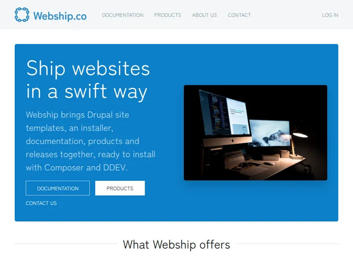

# Webship Portal

The Webship.co portal site template: a site to manage software, with documentation, products and releases,
a newsletter and social sharing, in [Webtheme](https://www.drupal.org/project/webtheme), the theme with the
Webship.co colors and design.

Maintained by [Webship](https://www.drupal.org/project/webship). Built on top of Drupal and
[Display Builder](https://www.drupal.org/project/display_builder). No Layout Builder displays and no Drupal
Canvas.

The site template works on its own: it applies the Web Admin, Web SEO, Web Security, Web Development, Web Page,
Web Assets, Web Editor, Web Config, Web Doc, Web Releases and Web Newsletter default recipes, the Web Dashboard
recipe and core recipes, never another site template.



## Install

With the [Website](https://www.drupal.org/project/website) project template and DDEV:

```shell
composer create-project drupal/website my_site
cd my_site
ddev config --project-type=drupal --docroot=web
ddev start
ddev composer require drupal/webship_portal
ddev drush site:install recipes/webship_portal -y
ddev launch
```

The [Webship](https://www.drupal.org/project/webship) installer lists the site templates: choose Webship Portal.

On an installed site, apply it as a recipe:

```shell
ddev composer require drupal/webship_portal
ddev drush recipe recipes/webship_portal
```

## What you get

- **Content types**: Webpage, with the media library (images, documents, audio, video) of Web Assets.
- **Webtheme** as the default theme, generated from UI Suite UIkit, with its blocks placed in the regions of
  its UIkit page: site branding, main and account menus in the navbar, the main and account menus in the offcanvas
  on small screens, breadcrumbs in the header, page title, local tasks and actions, and the footer and social media menus
  in the footer.
- [Web Doc](https://www.drupal.org/project/webdoc): documentation book pages at `/docs`.
- [Web Releases](https://www.drupal.org/project/webreleases): products and release notes, at `/products`.
- [Web Newsletter](https://www.drupal.org/project/webnewsletter): a newsletter subscription webform.
- [Webshare](https://www.drupal.org/project/webshare): social sharing buttons.
- **Contact webform** with anti-spam protection, at `/contact`.
- **Administration**: [Web Admin](https://www.drupal.org/project/webadmin) with Gin and its toolbar, Coffee,
  Project Browser and automatic updates; the Webmaster and Editorial default dashboards of the
  [Web Dashboard recipe](https://www.drupal.org/project/webdash), built with Display Builder.
- **SEO and security**: [Web SEO](https://www.drupal.org/project/webseo) with breadcrumbs, redirects, path
  aliases, metatags and the XML sitemap; [Web Security](https://www.drupal.org/project/websecurity) with anti-spam
  protection and login by email or username.
- **Editing and configuration**: the editor and configuration management features of Webship.

## Default content

A fresh install looks like a complete site, in the structure of Webship.co:

- **Front page**: a hero with calls to action, six feature cards (site templates, the installer, documentation,
  products and releases, the newsletter, Display Builder and UIkit), three image sections and the newsletter signup.
- **Documentation** at `/docs`: an index and six guides (getting started, install with Composer, choose a site
  template, dashboards, build pages with Display Builder, theme the site with Webtheme).
- **Products** at `/products`: the Webship installer, Webtheme, the Website Starter and the Webship Starter, each
  with an image and its release notes.
- **About us** at `/about` and **Contact** at `/contact`.
- **Menus**: the main, footer and social media menus.
- **Media**: six images in the media library: five CC0 photos and a product shot of the portal.

No slogan is set: the pages are titled with their own title and the site name.

## Image credits

The photos in `content/file` are released under CC0 (public domain dedication), and were resized for the web:

| File | Photo | Author | License |
| --- | --- | --- | --- |
| `designer-two-screen-setup.jpg` | [Designer's two-screen setup](https://commons.wikimedia.org/wiki/File:Designer%27s_two-screen_setup_(Unsplash).jpg) | Lee Campbell | CC0 |
| `developer-laptop-code.jpg` | [Laptop coding programs](https://commons.wikimedia.org/wiki/File:Laptop_coding_programs_(Unsplash).jpg) | Tirza van Dijk | CC0 |
| `code-on-monitor.jpg` | [Code on computer monitor](https://commons.wikimedia.org/wiki/File:Code_on_computer_monitor_(Unsplash).jpg) | Markus Spiske | CC0 |
| `code-editor-laptop.jpg` | [Code editor on a laptop](https://commons.wikimedia.org/wiki/File:Pexels-luis-gomes-546819.jpg) | Luis Gomes | CC0 |
| `team-planning-laptops.jpg` | [Planning with laptops](https://commons.wikimedia.org/wiki/File:Helloquence-61189.jpg) | Helloquence | CC0 |

`webship-portal-product-shot.jpg` is a screenshot of the Webship Portal front page with Webtheme, distributed
with this project under GPL-2.0-or-later.

## Requirements

- Drupal 11.4 or later.
- PHP 8.3 or later.
- Composer 2.
