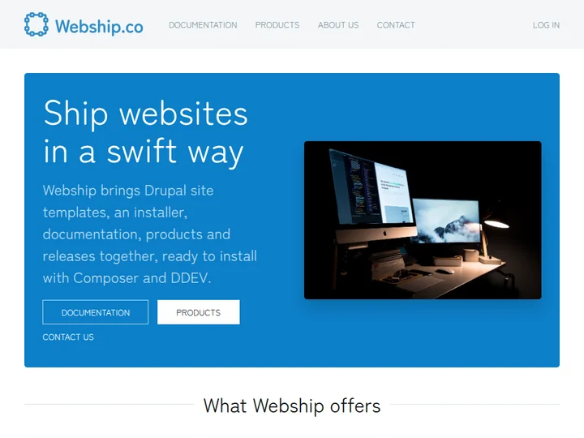

# Webship Portal

The Webship.co portal site template: a site about automated functional testing, with products and releases,
services, documentation, a blog, a newsletter and a contact page, in
[Webtheme](https://www.drupal.org/project/webtheme), the theme with the Webship.co colors and design.

Maintained by [Webship](https://www.drupal.org/project/webship). Built on top of Drupal and
[Display Builder](https://www.drupal.org/project/display_builder). No Layout Builder displays and no Drupal
Canvas.

The site template works on its own: it applies the Web Admin, Web SEO, Web Security, Web Development, Web Page,
Web Assets, Web Editor, Web Config, Web Doc, Web Releases, Web Blog and Web Newsletter default recipes, the Web
Dashboard recipe and core recipes, never another site template.



## Install

Composer runs inside DDEV, so nothing is needed on your machine but DDEV itself. Start from the
[Website](https://www.drupal.org/project/website) project template, which ships this site template:

```shell
mkdir -p ~/workspace/projects/my-portal
cd ~/workspace/projects/my-portal
ddev config --project-type=drupal11 --docroot=web --php-version=8.4
ddev start
ddev composer create-project drupal/website:^1.0@alpha
ddev drush site:install ../recipes/webship_portal -y --account-name=webmaster --site-name="Webship.co"
ddev launch
```

Pass `--site-name`: the installer writes the site name after the recipe is applied, so the name the recipe
sets is kept only when the recipe is applied to an installed site.

Or open the site with `ddev launch` and pick Webship Portal in the installer.

On an installed site, apply it as a recipe:

```shell
ddev composer require drupal/webship_portal:^1.0@alpha
ddev drush recipe ../recipes/webship_portal
```

## What you get

- **Webtheme** as the default theme, with one Display Builder page layout for every page: the header with the
  logo and the main menu, the content, the call to action "Boost your site's success with automated testing",
  and the footer with the logo, the footer menu, the social media menu, the automated testing badge and the
  copyright.
- [Web Releases](https://www.drupal.org/project/webreleases): products and release notes, under `/products`.
- [Web Doc](https://www.drupal.org/project/webdoc): documentation pages, under `/docs`, with the search of
  Drupal core.
- [Web Blog](https://www.drupal.org/project/webblog): blog posts, listed at `/blog` with a search field, and
  the latest posts on the home page.
- [Web Newsletter](https://www.drupal.org/project/webnewsletter): the newsletter form of the home page.
- [Webshare](https://www.drupal.org/project/webshare): social sharing buttons.
- **Contact form** with anti-spam protection, on the contact page.
- **Administration**: [Web Admin](https://www.drupal.org/project/webadmin) with UIkit Admin, the bulk actions
  of the content overview, and the Webmaster and Editorial dashboards of the
  [Web Dashboard recipe](https://www.drupal.org/project/webdash).
- **Editors** edit and delete any content, and every content type moves through the editorial workflow.
- **SEO and security**: [Web SEO](https://www.drupal.org/project/webseo) and
  [Web Security](https://www.drupal.org/project/websecurity).

## Default content

A fresh install has the parts of Webship.co:

- **Home**: a hero with the Webship.co video, what Webship loves to help with, the latest blog posts, the
  latest release, a services block and the newsletter form.
- **Products** at `/products`: Webship-js, the Diffy steps, the Webship-js AI agent and skills, the DDEV
  add-on and Webship-portal, each with its releases.
- **Services** at `/services`: Automated Functional Testing Setup, Configure Remote CI/CD and
  Cucumber/Gherkin descriptions.
- **Docs** at `/docs`: Webship-JS 2.0.x, Install Webship-JS and Step Definitions.
- **Blog** at `/blog`: the nine posts of Webship.co and six general articles about automated functional
  testing, each with a Gherkin example.
- **About us** at `/about-us`, **Contact** at `/contact` and the **Privacy Policy** at `/privacy-policy`.
- **Menus**: main (Home, Products, Services, Docs, Blog, About us, Contact), footer and social media. The
  Products link comes from the Web Releases recipe; the other links are placed around its weight.

The texts and images come from [Webship.co](https://webship.co) and are distributed with this project under
GPL-2.0-or-later. The badge in the footer is a static image that links to the automated tests of Webship.co:
nothing is loaded from another site.

## Pages built with Display Builder

- **One page layout** (`default`) frames every page of Webtheme with the Header, Page and Footer components.
  The log in, password reset and registration screens keep their own page.
- **A page can carry its own display.** The Webpage content type has a "Page display" field: the Home,
  Products, Services, Docs, About us and Contact pages are built in it, and an editor changes them from the
  "Display" tab of the page. A page without a display shows its body.
- A section with a background goes from edge to edge when the display starts with a Container component.

## Tests

The `tests/features` folder holds the [Webship-js](https://webship.co/docs/webship-js/2.0.x) scenarios of the
template: the menus, the home page, the shell of every page, the blog, the services, the products, the
documentation, the contact and about pages, the roles and the accessibility of the pages.

```shell
npm install
LAUNCH_URL=https://my-portal.ddev.site DRUPAL_PROJECT_DIR=~/workspace/projects/my-portal npm test
```

## Requirements

- Drupal 11.4 or later.
- PHP 8.3 or later.
- Composer 2.
